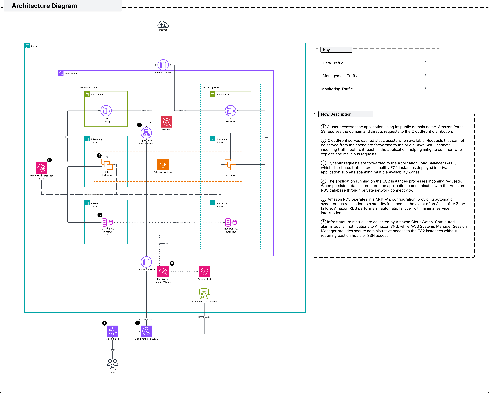

# Production-Oriented Scalable Web Application on AWS

> A production-oriented AWS infrastructure deployed using Terraform, demonstrating secure, scalable, and highly available cloud architecture through a modular Infrastructure as Code approach.


---

## Design Goals

The infrastructure was designed around the following principles:

- High Availability
- Scalability
- Security
- Modularity
- Maintainability
- Infrastructure as Code

## Solution Overview

This repository contains the infrastructure code and supporting documentation for a production-oriented web application environment deployed on AWS using Terraform.

The infrastructure is organized into logical layers that separate networking, security, compute, database, edge, and monitoring responsibilities into reusable Terraform modules. This layered approach improves maintainability, encourages reuse, and clearly defines the responsibility of each component.

In addition to the Terraform implementation, the repository includes detailed architectural documentation explaining the design decisions, infrastructure layers, and request lifecycle.

---

## Value Proposition

Modern web applications require infrastructure that is resilient, scalable, secure, and easy to operate. This project demonstrates how these requirements can be addressed using managed AWS services and Infrastructure as Code.

The architecture distributes workloads across multiple Availability Zones, isolates application resources within private networks, automatically scales compute capacity in response to demand, and provides centralized monitoring and operational visibility. The result is a production-oriented foundation that is both maintainable and extensible.

---

## Repository Structure

```text
terraform/
├── environments/
└── modules/
    ├── networking/
    ├── security/
    ├── compute/
    ├── database/
    ├── edge/
    └── monitoring/

documentation/
└── architecture/
```

---

## Documentation

| Document | Description |
|----------|-------------|
| [Solution Architecture](documentation/architecture/README.md) | Overall architecture, request flow, design decisions, and module relationships |
| [Networking Layer](terraform/modules/network/README.md) | VPC, subnets, routing, NAT Gateway, and connectivity |
| [Security Layer](terraform/modules/security/README.md) | Security Groups, IAM, Session Manager, and security controls |
| [Compute Layer](terraform/modules/compute/README.md) | Application Load Balancer, Launch Template, Auto Scaling, and EC2 |
| [Database Layer](terraform/modules/database/README.md) | Amazon RDS deployment and database architecture |
| [Edge Layer](terraform/modules/edge/README.md) | Route 53, CloudFront, and AWS WAF |
| [Monitoring Layer](terraform/modules/monitoring/README.md) | CloudWatch dashboards, alarms, and SNS notifications |

---

## Quick Start

1. Clone the repository.
2. Configure the appropriate Terraform environment.
3. Review and update environment-specific variables.
4. Initialize Terraform.
5. Review the execution plan.
6. Apply the infrastructure.

Refer to the environment configuration under `terraform/environments/` for deployment-specific settings.
