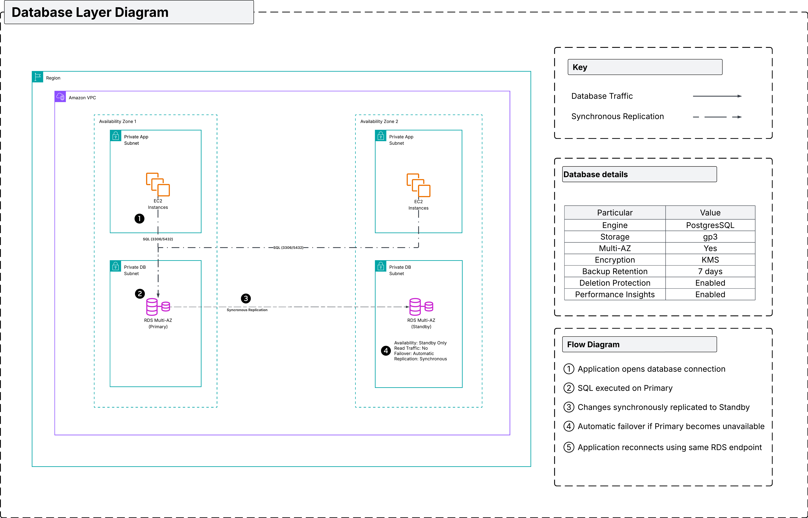

# Database Layer

> Provides highly available, managed relational database services for the application while ensuring data durability, secure connectivity, and operational simplicity.

## Architecture

> **Figure 1.** Database layer illustrating the Multi-AZ deployment, private database subnets, and secure application connectivity.

## Overview

The database layer provides a managed relational database service using Amazon RDS deployed across two Availability Zones.

The primary database instance serves application requests, while a synchronous standby instance is maintained in a separate Availability Zone to provide automatic failover in the event of infrastructure or Availability Zone failures.

Application instances connect to the database using the RDS endpoint, allowing failover events to occur transparently without requiring application reconfiguration.

## Components

| Component | Purpose |
|------------|----------|
| Amazon RDS | Managed relational database service for persistent application data. |
| Primary Database Instance | Processes application read and write operations. |
| Standby Database Instance | Maintains a synchronized copy of the primary database for automatic failover. |
| DB Subnet Group | Defines the private subnets available for database deployment. |
| Parameter Group                | Defines database engine configuration.                               |

## Database Deployment

The database is deployed using Amazon RDS Multi-AZ.

The deployment consists of:

- One primary database instance
- One synchronous standby instance
- Private database subnets in two Availability Zones
- A single database endpoint presented to the application

The standby instance is not used to serve application traffic but is maintained to support automatic failover.

## Design Decisions

### Managed Database Service

Amazon RDS is used instead of self-managed databases on EC2 to reduce operational overhead while providing automated backups, patching, and failover capabilities.

### Multi-Availability Zone Deployment

Database replication across multiple Availability Zones improves resilience by providing automatic failover in the event of infrastructure failure.

### Private Database Network

The database resides exclusively within dedicated private database subnets and accepts traffic only from the application Security Group.

### Application Transparency

Applications connect using the managed database endpoint, allowing Amazon RDS to perform failover without requiring configuration changes within the application.

### Backup & Recovery

Amazon RDS provides built-in data protection capabilities.

The implementation supports:

- Automated backups
- Point-in-time recovery
- Manual snapshots
- Automatic storage management

These capabilities simplify operational management while improving data durability.

---

## Module Interface 

### Key Inputs

| Variable                     | Description                                          |
| ---------------------------- | ---------------------------------------------------- |
| `db_engine`                  | Database engine (MySQL or PostgreSQL).               |
| `db_instance_class`          | Compute capacity allocated to the database instance. |
| `allocated_storage`          | Initial storage allocation.                          |
| `db_subnet_ids`              | Private database subnets used by Amazon RDS.         |
| `database_security_group_id` | Security Group allowing application connectivity.    |

### Key Outputs

| Output                 | Description                      |
| ---------------------- | -------------------------------- |
| `db_endpoint`          | Application connection endpoint. |
| `db_identifier`        | Database instance identifier.    |
| `db_subnet_group_name` | Database subnet group.           |

## Related Documentation

| Document | Description |
|----------|-------------|
| [`../../../documentation/architecture/README.md`](../../../documentation/architecture/README.md) | Overall solution architecture and design decisions. |
| [`../networking/README.md`](../network/README.md) | Network topology hosting the database layer. |
| [`../security/README.md`](../security/README.md) | Security controls protecting database access. |
| [`../compute/README.md`](../compute/README.md) | Application layer consuming the database service. |
