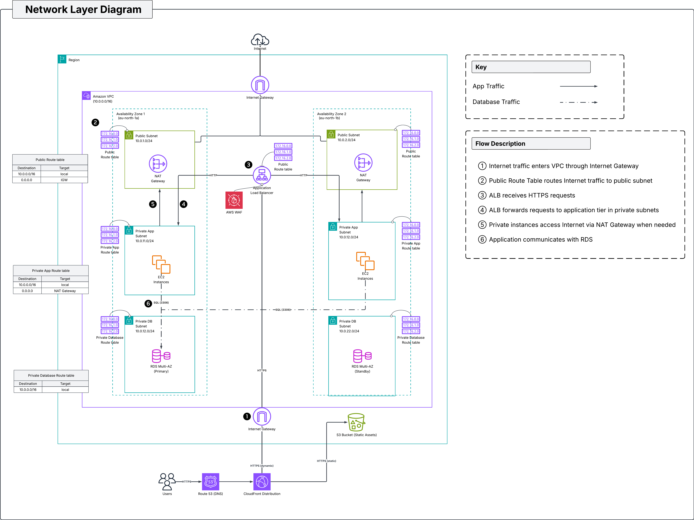

# Network Layer

> Provides the foundational network infrastructure for the solution by establishing secure network boundaries, subnet segmentation, routing, and controlled internet connectivity.

## Architecture

> **Figure 1.** Networking layer illustrating the Virtual Private Cloud (VPC), subnet segmentation, routing strategy, and internet connectivity.

### Overview

The networking architecture spans two Availability Zones to improve fault tolerance and support highly available application deployments. Public subnets host internet-facing resources, while application and database workloads remain isolated within private subnets.

Separate subnet tiers and route tables enforce traffic boundaries and ensure that only the resources requiring internet connectivity are publicly accessible.

## Components

| Component | Purpose |
|------------|----------|
| Virtual Private Cloud (VPC) | Provides logical network isolation for all infrastructure resources. |
| Public Subnets | Host internet-facing resources such as the Application Load Balancer and NAT Gateway. |
| Private Application Subnets | Host EC2 instances running the application workload. |
| Private Database Subnets | Host Amazon RDS within isolated database subnets. |
| Internet Gateway | Enables inbound and outbound internet connectivity for public resources. |
| NAT Gateway | Allows outbound internet connectivity for workloads in private application subnets. |
| Route Tables | Control traffic flow between subnet tiers and external networks. |
| Network ACLs | Provide stateless network filtering at the subnet boundary. |

## Routing Design

| Route Table | Associated Subnets | Default Route |
|--------------|-------------------|---------------|
| Public | Public Subnet A, Public Subnet B | Internet Gateway |
| Private Application | Private App Subnet A, Private App Subnet B | NAT Gateway |
| Private Database | Private DB Subnet A, Private DB Subnet B | Local Only |

Traffic destined for the internet follows different paths depending on the subnet tier:

- Public subnet traffic is routed directly through the Internet Gateway.
- Application subnet traffic uses the NAT Gateway for outbound internet connectivity while remaining unreachable from the internet.
- Database subnet traffic remains entirely within the VPC and has no direct internet route.

## Design Decisions

### Multi-Availability Zone Deployment

Resources are distributed across two Availability Zones to improve resilience and reduce the impact of infrastructure failures.

### Public and Private Subnet Separation

Internet-facing resources are deployed within public subnets, while application and database workloads remain isolated in private subnets. This minimizes the attack surface and ensures that only required components are publicly accessible.

### Dedicated Database Subnets

Database resources are deployed within dedicated private database subnets, preventing direct internet access and allowing database-specific routing and security controls.

### Cost Optimization

To reduce infrastructure costs within the learning environment, the implementation uses a single NAT Gateway. In production environments, a NAT Gateway would typically be deployed within each Availability Zone to eliminate cross-AZ dependencies and improve fault tolerance.

---

## Module Interface

### Key Inputs

| Variable | Description |
|----------|-------------|
| `vpc_cidr` | CIDR block assigned to the VPC. |
| `availability_zones` | Availability Zones used by the deployment. |
| `public_subnet_cidrs` | CIDR ranges for public subnets. |
| `private_app_subnet_cidrs` | CIDR ranges for application subnets. |
| `private_db_subnet_cidrs` | CIDR ranges for database subnets. |

### Key Outputs

| Output | Description |
|---------|-------------|
| `vpc_id` | Identifier of the created VPC. |
| `public_subnet_ids` | Public subnet identifiers. |
| `private_app_subnet_ids` | Application subnet identifiers. |
| `private_db_subnet_ids` | Database subnet identifiers. |
| `private_route_table_ids` | Route tables associated with private subnets. |

---

## Related Documentation

| Document | Description |
|----------|-------------|
| [`../../../documentation/architecture/README.md`](../../../documentation/architecture/README.md) | Overall solution architecture and request lifecycle. |
| [`../security/README.md`](../security/README.md) | Security controls applied to the networking layer. |
| [`../compute/README.md`](../compute/README.md) | Application resources deployed within the network. |
| [`../database/README.md`](../database/README.md) | Database resources hosted in private database subnets. |
